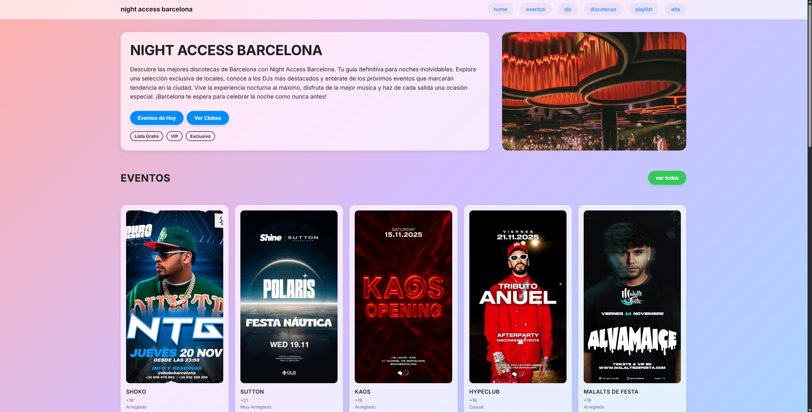
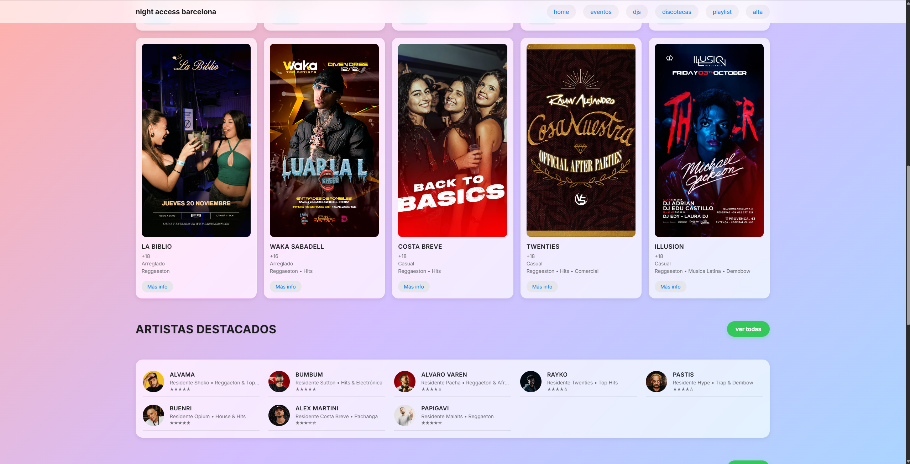
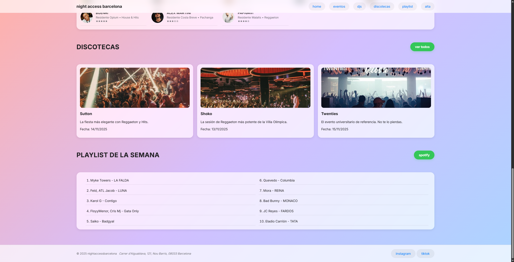
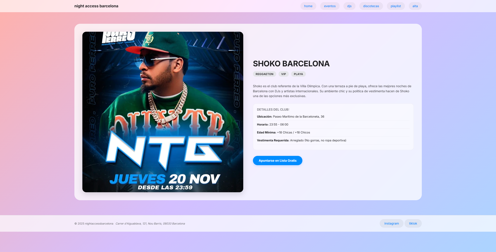
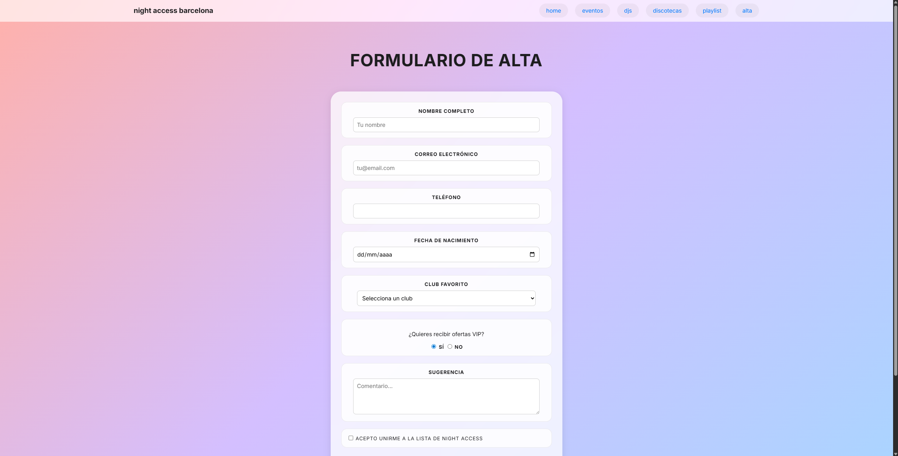
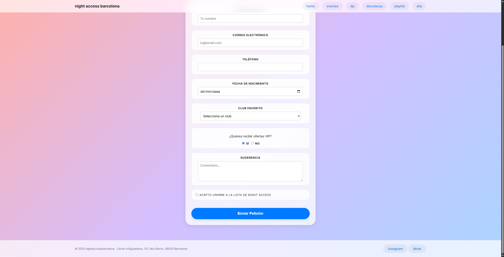
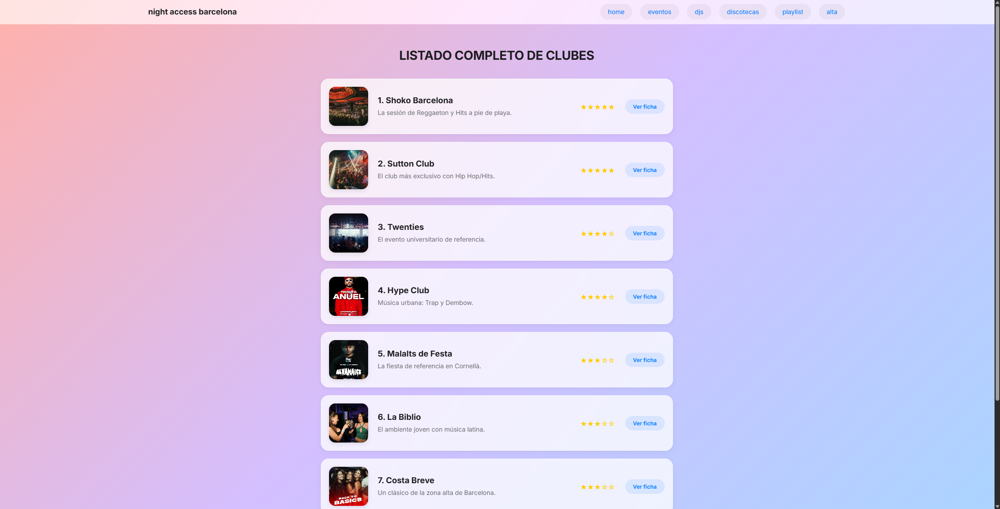
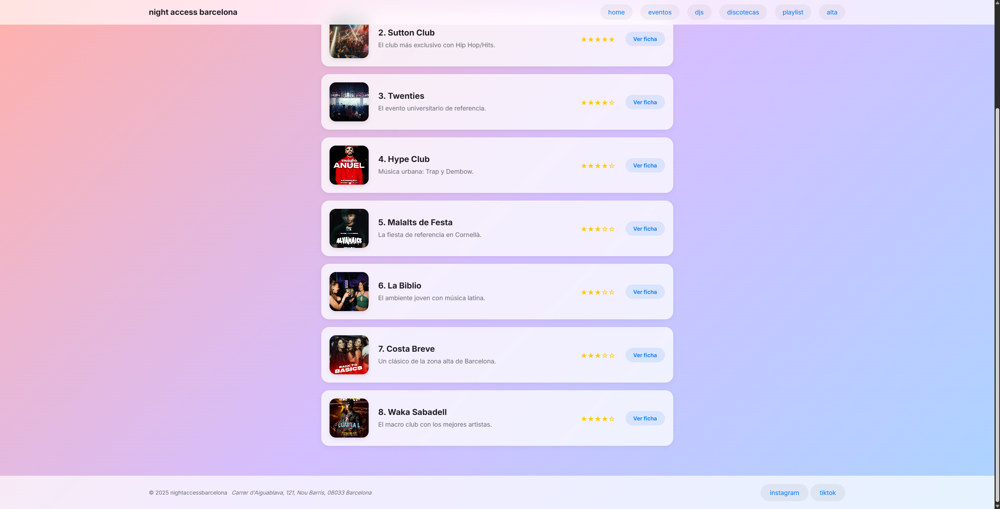

# Night Access Barcelona 🌃

¡Bienvenido a mi primer proyecto web! 👋

Este repositorio contiene el código fuente de **Night Access Barcelona**, un sitio web desarrollado como práctica final para la asignatura de **Lenguaje de Marcas**.

El objetivo del proyecto es construir una web multipágina desde cero, escribiendo todo el HTML y CSS sin utilizar librerías ni frameworks externos.

## 🚀 Descripción del Proyecto

**Night Access** es una guía digital de ocio nocturno centrada en Barcelona. Permite:

- Explorar las mejores discotecas
- Consultar la agenda de eventos
- Conocer a los DJs residentes
- Apuntarse a listas de invitados

Aunque es un proyecto académico, está diseñado como si fuera un producto real, con una estética moderna y cuidada.

## ✨ Características Principales

- **Diseño Glassmorphism:** Transparencias y desenfoques con `backdrop-filter` para una estética moderna.
- **Navegación Sticky:** El menú principal permanece fijo al hacer scroll.
- **Layout Responsive:** Uso de CSS Grid y Flexbox según la estructura y alineación.
- **Galería con CSS Grid:** Grid adaptable para la galería de discotecas.
- **Flexbox para navegación y listas.**
- **Formularios Avanzados:** Inputs variados, validaciones HTML5 y una experiencia de usuario intuitiva.

## 🛠️ Tecnologías Utilizadas

- **HTML5** (estructura semántica)
- **CSS3**
- **Variables globales con `:root`**
- **Flexbox y Grid**
- **Transiciones y efectos visuales**

## 📸 Capturas de Pantalla

El repositorio incluye capturas de:

## ⭐ Valoración Personal

Esta práctica ha resultado muy enriquecedora, ya que siempre había tenido la motivación de crear una página propia, pero nunca había tenido ni el tiempo ni los conocimientos necesarios para hacerlo. Esta experiencia me ha permitido enfrentarme a retos reales de diseño web y, sobre todo, a la estructuración desde cero de un contenido que no venía definido por la guía de la práctica.

Considero que este proyecto establece una base sólida que podré seguir evolucionando para plasmar ideas personales. Gracias a la formación recibida en clase, a los conocimientos que sigo adquiriendo en la asignatura y al uso sensato de herramientas de IA —que me han ayudado especialmente en aspectos de responsividad o en la generación repetitiva de elementos—, ahora me siento capacitado para desarrollar páginas web con un acabado profesional.

## 👤 Autor

**Gerard Maestre**  
Estudiante de DAM
